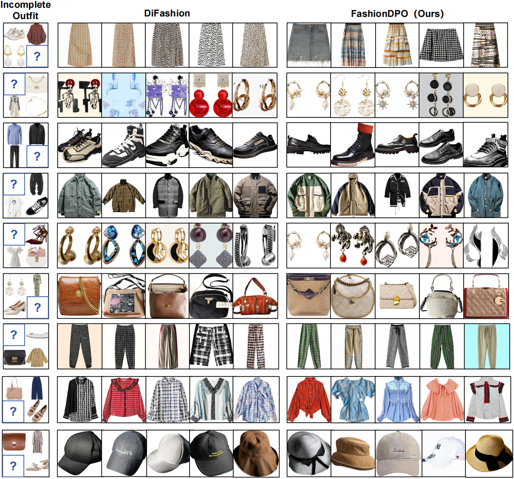

# FashionDPO

This is the implementation of FashionDPO.



## TODO List
- [x] Environment
- [x] Datasets
- [x] Fashion Image Generation without Feedback
- [x] Feedback Generation from Multiple Experts
- [x] Model Fine-tuning with Direct Preference Optimization
- [x] Release checkpoint

## Installation
Clone this repository:
```
git clone https://github.com/Yzcreator/FashionDPO.git
cd ./FashionDPO/
```
Install PyTorch and other dependencies:
```
conda env create -f fashiondpo_environment.yml
conda activate FashionDPO
```

## Datasets

We follow the previous work [DiFashion](https://github.com/YiyanXu/DiFashion?tab=readme-ov-file) and use the datasets of iFashion and Polyvore-U, which include the required data of both fashion outfit and user-fashion item interactions. 

## Fashion Image Generation without Feedback

During the sampling phase, this code generates 7 recommended items for each outfit as a candidate set. 
```
cd ./fashiondpo
python sample.py
```
If it is the first round of sampling in the iterative process, set `args.resume=False`, which will create the LoRA layers in the pre-trained model. In subsequent rounds, set `args.resume=True` to load the fine-tuned LoRA layers from the model specified in args.pretrained_model_name_or_path.

## Feedback Generation from Multiple Experts

### Get Feedback
We locally deploy MiniCPM to evaluate "Quality". For "Compatibility", we train a VBPR model using paired outfit data from the POG and Polyvore-U dataset. "Personalization" is evaluated using the CLIP Score.
```
cd ./fashiondpo
python sample.py
```
